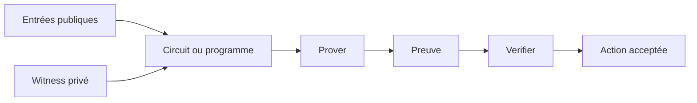
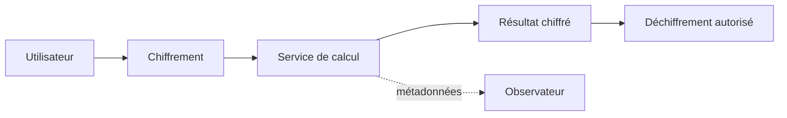

# Schémas d’architecture

## Pipeline ZK

## Frontière FHE

## Lecture

Ces schémas sont conceptuels. Ils rendent visibles les acteurs, les flux et les frontières ; ils ne remplacent pas la vérification des composants réels.
