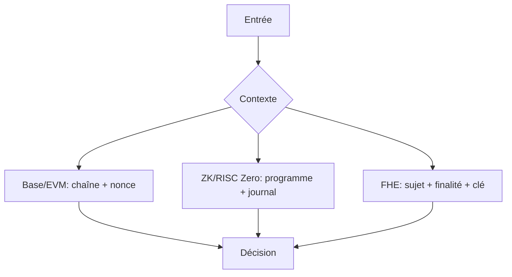

# Modèle de menaces Digital A7

- Base : séquenceur indisponible, données L1 indisponibles, dérivation incohérente, clés admin compromises.
- EVM/HyperEVM : mauvais chain ID, rejeu, nonce réutilisé, domaine de signature absent.
- ZK/RISC Zero : mauvais programme, statement ou journal, receipt liée au mauvais contexte.
- FHE : finalité non autorisée, clé révoquée, fuite de métadonnées.

